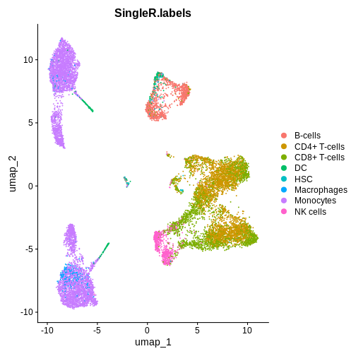
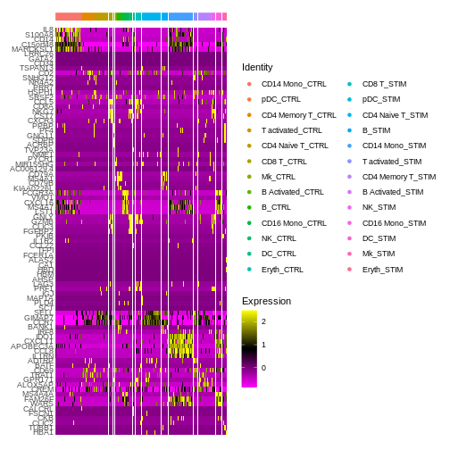

:::::::::::::::::::::::::::::::::::::: questions 

- How do conserved markers help us label clusters reliably across conditions?
- What exactly do avg_log2FC, pct.1, pct.2, and p_val_adj mean in FindMarkers?
- Why must DE be run within a cell type (e.g., CD16 Mono_STIM vs CD16 Mono_CTRL) rather than “all cells”?

::::::::::::::::::::::::::::::::::::::::::::::::

::::::::::::::::::::::::::::::::::::: objectives

- Use FindConservedMarkers() to pick markers and label clusters.
- Set identities to annotations and create compound identities (celltype.and.stim) for clean contrasts.
- Run FindMarkers() to get DEGs between conditions within a cell type and interpret key columns.
- Visualize DEGs (FeaturePlot with split.by, DoHeatmap / pheatmap) and export results for downstream use.
- Recognize pitfalls (composition effects, inappropriate contrasts, overly lenient thresholds).

::::::::::::::::::::::::::::::::::::::::::::::::


``` error
Error in getGlobalsAndPackages(expr, envir = envir, globals = globals): The total size of the 7 globals exported for future expression ('FUN()') is 500.01 MiB. This exceeds the maximum allowed size 500.00 MiB per by R option "future.globals.maxSize". This limit is set to protect against transfering too large objects to parallel workers by mistake, which may not be intended and could be costly. See help("future.globals.maxSize", package = "future") for further explainations and how to adjust or remove this threshold The three largest globals are 'FUN' (250.83 MiB of class 'function'), 'index' (247.59 MiB of class 'S4') and 'query' (1.59 MiB of class 'numeric')
```

``` error
Error in `object[[reduction]]` at Seurat/R/dimensional_reduction.R:1912:5:
! 'integrated.cca' not found in this Seurat object
 
```

``` error
Error in `object[[reduction]]` at Seurat/R/clustering.R:798:5:
! 'integrated.cca' not found in this Seurat object
 
```

``` error
Error in FindClusters.Seurat(ifnb.filtered, resolution = 0.5): Provided graph.name not present in Seurat object
```


``` r
DimPlot(ifnb.filtered, reduction = "umap.cca", label = T)
```

``` error
Error in `object[[reduction]]` at Seurat/R/visualization.R:901:3:
! 'umap.cca' not found in this Seurat object
 
```


``` r
DimPlot(ifnb.filtered, reduction = "umap.cca", group.by = "stim")
```

``` error
Error in `object[[reduction]]` at Seurat/R/visualization.R:901:3:
! 'umap.cca' not found in this Seurat object
 
```


## Step 1. Find Conserved Markers to label our celltypes


``` r
## Let's look at conserved markers in cluster 4 across our two conditions (compared to all other clusters)
markers.cluster.4 <- FindConservedMarkers(ifnb.filtered, ident.1 = 4,
                     grouping.var = 'stim')
```

``` warning
Warning: Identity: 4 not present in group CTRL. Skipping CTRL
```

``` warning
Warning: Identity: 4 not present in group STIM. Skipping STIM
```

``` error
Error in marker.test[[i]]: subscript out of bounds
```

``` r
head(markers.cluster.4)
```

``` error
Error in h(simpleError(msg, call)): error in evaluating the argument 'x' in selecting a method for function 'head': object 'markers.cluster.4' not found
```

Let's visualise the top upregulated, conserved between condition,
marker genes identified in cluster 4 using the `FeaturePlot()` function.


::::: discussion

Try running the function in the code block below without
defining a min.cutoff, or changing the value of the min.cutoff
parameter.

:::::


``` r
# Try looking up some of these markers here: https://www.proteinatlas.org/
FeaturePlot(ifnb.filtered, reduction = "umap.cca", 
            features = c('VMO1', 'FCGR3A', 'MS4A7', 'CXCL16'), min.cutoff = 'q10')
```

``` error
Error in `object[[reduction]]` at Seurat/R/visualization.R:1216:3:
! 'umap.cca' not found in this Seurat object
 
```


``` r
# I happen to know that the cells in cluster 3 are CD16 monocytes - lets rename this cluster
# Idents(ifnb.filtered) # Let's look at the identities of our cells at the moment
```


``` r
ifnb.filtered <- RenameIdents(ifnb.filtered, '4' = 'CD16 Mono') # Let's rename cells in cluster 3 with a new cell type label
```

``` error
Error in RenameIdents.Seurat(ifnb.filtered, `4` = "CD16 Mono"): Cannot find any of the provided identities
```

``` r
# Idents(ifnb.filtered) # we can take a look at the cell identities again
```


``` r
DimPlot(ifnb.filtered, reduction = "umap.cca", label = T) +
  ggtitle("After changing the identity of cluster 4")
```

``` error
Error in `object[[reduction]]` at Seurat/R/visualization.R:901:3:
! 'umap.cca' not found in this Seurat object
 
```


## Step 2: Set the identity of our clusters to the annotations provided


``` r
Idents(ifnb.filtered) <- ifnb.filtered@meta.data$seurat_annotations
# Idents(ifnb.filtered)
```


``` r
DimPlot(ifnb.filtered, reduction = "umap.cca", label = T)
```

``` error
Error in `object[[reduction]]` at Seurat/R/visualization.R:901:3:
! 'umap.cca' not found in this Seurat object
 
```


:::: callout

If you want to perform cell-type identification on your own data
when you don't have a ground-truth, using automatic cell type annotation
methods can be a good starting point. This approach is discussed in more
detail in the Intro to scRNA-seq workshop material.

::::


## Step 3: Find differentially expressed genes (DEGs) between our two conditions, using CD16 Mono cells as an example


``` r
# Make another column in metadata showing what cells belong to each treatment group (This will make more sense in a bit)
ifnb.filtered$celltype.and.stim <- paste0(ifnb.filtered$seurat_annotations, '_', ifnb.filtered$stim)
# (ifnb.filtered@meta.data)

Idents(ifnb.filtered) <- ifnb.filtered$celltype.and.stim

DimPlot(ifnb.filtered, reduction = "umap.cca", label = T) # each cluster is now made up of two labels (control or stimulated)
```

``` error
Error in `object[[reduction]]` at Seurat/R/visualization.R:901:3:
! 'umap.cca' not found in this Seurat object
 
```


``` r
DimPlot(ifnb.filtered, reduction = "umap.cca", 
        label = T, split.by = "stim") # Lets separate by condition to see what we've done a bit more clearly
```

``` error
Error in `object[[reduction]]` at Seurat/R/visualization.R:901:3:
! 'umap.cca' not found in this Seurat object
 
```


::::::::::::::::::::::::::::::::::::: challenge 
Automated Cell Type Annotation

:::::::::::::::::::::::: solution 


``` r
# Load reference data 
# Blood & immune lineages
ref.set <- celldex::BlueprintEncodeData()

ifnb.v4 <- JoinLayers(ifnb.filtered)
sce.ifnb.filtered <- as.SingleCellExperiment(ifnb.v4)
sce.ifnb.filtered <- logNormCounts(sce.ifnb.filtered)

pred.cnts <- SingleR(
  test = sce.ifnb.filtered,
  ref = ref.set,
  labels = ref.set$label.main
)

lbls.keep <- table(pred.cnts$labels)>10
# Add SingleR labels to Seurat metadata
ifnb.filtered$SingleR.labels <- sce.ifnb.filtered$SingleR.labels
ifnb.filtered$SingleR.labels <- ifelse(lbls.keep[pred.cnts$labels], pred.cnts$labels, 'Other')

# Run UMAP (based on PCA)
ifnb.filtered <- RunUMAP(ifnb.filtered, dims = 1:20)
DimPlot(ifnb.filtered, reduction='umap', group.by='SingleR.labels')
```



:::::::::::::::::::::::::::::::::

:::::::::::::::::::::::::::::::::::

We'll now leverage these new identities to compare DEGs between our
treatment groups


``` r
treatment.response.CD16 <- FindMarkers(ifnb.filtered, ident.1 = 'CD16 Mono_STIM', 
                                       ident.2 = 'CD16 Mono_CTRL')
```

``` output
For a (much!) faster implementation of the Wilcoxon Rank Sum Test,
(default method for FindMarkers) please install the presto package
--------------------------------------------
install.packages('devtools')
devtools::install_github('immunogenomics/presto')
--------------------------------------------
After installation of presto, Seurat will automatically use the more 
efficient implementation (no further action necessary).
This message will be shown once per session
```

``` r
head(treatment.response.CD16) # These are the genes that are upregulated in the stimulated versus control group
```

``` output
               p_val avg_log2FC pct.1 pct.2     p_val_adj
IFIT1  1.379187e-176   5.834216 1.000 0.094 1.938172e-172
ISG15  6.273887e-166   5.333771 1.000 0.478 8.816694e-162
IFIT3  1.413978e-164   4.412990 0.992 0.314 1.987063e-160
ISG20  6.983755e-164   4.088510 1.000 0.448 9.814270e-160
IFITM3 1.056793e-161   3.191513 1.000 0.634 1.485111e-157
IFIT2  7.334976e-159   4.622453 0.974 0.162 1.030784e-154
```

## Step 4: Lets plot conserved features vs DEGs between conditions


``` r
FeaturePlot(ifnb.filtered, reduction = 'umap.cca', 
            features = c('VMO1', 'FCGR3A', 'IFIT1', 'ISG15'),
            split.by = 'stim', min.cutoff = 'q10')
```

``` error
Error in `object[[reduction]]` at Seurat/R/visualization.R:1216:3:
! 'umap.cca' not found in this Seurat object
 
```


## Step 5: Create a Heatmap to visualise DEGs between our two conditions + cell types


``` r
# Find upregulated genes in each group (cell type and condition)
ifnb.treatVsCtrl.markers <- FindAllMarkers(ifnb.filtered,
                                          only.pos = TRUE)
```


``` r
saveRDS(ifnb.treatVsCtrl.markers, "ifnb_stimVsCtrl_markers.rds")
```


If the top code block takes too long to run - you can download the rds
file of the output using the code below:

Seurat's in-built heatmap function can be quite messy and hard to
interpret sometimes (we'll learn how to make better and clearer custom
heatmaps using the pheatmap package from our Seurat expression data
later on).


``` r
ifnb.treatVsCtrl.markers <- readRDS(url("https://github.com/manveerchauhan/Seurat_DE_Workshop/raw/refs/heads/main/ifnb_stimVsCtrl_markers.rds"))

top5 <- ifnb.treatVsCtrl.markers %>%
  group_by(cluster) %>%
  dplyr::filter(avg_log2FC > 1) %>%
  slice_head(n = 5) %>%
  ungroup()

DEG.heatmap <- DoHeatmap(ifnb.filtered, features = top5$gene,
          label = FALSE)

DEG.heatmap
```




::::::::::::::::::::::::::::::::::::: keypoints 
- QC filtering removes low-quality cells (e.g., low gene count or high mitochondrial %).
- Integration corrects sample-to-sample variation so cells group by biology, not by batch.
- Harmony and CCA both align shared cell states but use different mathematical strategies.

::::::::::::::::::::::::::::::::::::::::::::::::
